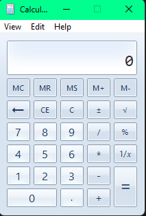

# Rainbow Titlebar

Animated RGB colors for Windows title bars using Windhawk.



## Features

- Smooth RGB animation
- Automatic color cycling
- Lightweight
- Restores default colors when disabled

## Installation

1. Install [Windhawk](https://windhawk.net/)
2. Enable Developper Mod (> Settings > Developper Mode)
3. Create a new mod
4. Copy `src/rainbow-titlebar.cpp`
5. Paste it into the Windhawk editor
6. Compile and enable the mod

## Speed

Edit this line in `rainbow-titlebar.cpp`:

```cpp
int p = (int)((time / 2) % 1536);

Lower value = faster animation.

## Compatibility
Windows 10 / 11.

Some applications may not support custom title bar colors.
